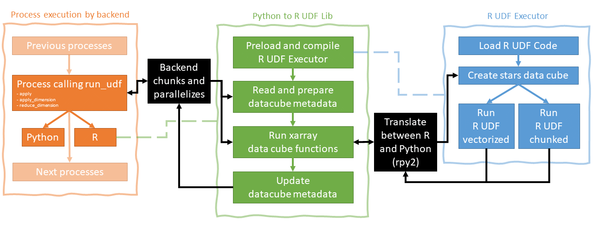

# openeo-udf-python-to-r

This is an experimental engine for openEO to run R UDFs from an R environment.

This currently is limited to R UDFs that are running without any other processes in the following processes:
- `apply`
- `reduce_dimension`

This repository contains the following content:
- The script to run for testing is `test.py`.
- The folder `udfs` contains example UDFs as users could provide them.
- The script to benchmark againt plain R is `benchmark.R`.
- `udf_lib.py` is a Python library with the Python code required to run R UDFs from Python
- `executor.r` is the R script that is run from R and executes the R UDF in the Python environment.

The following image shows how the implementation roughly works:
